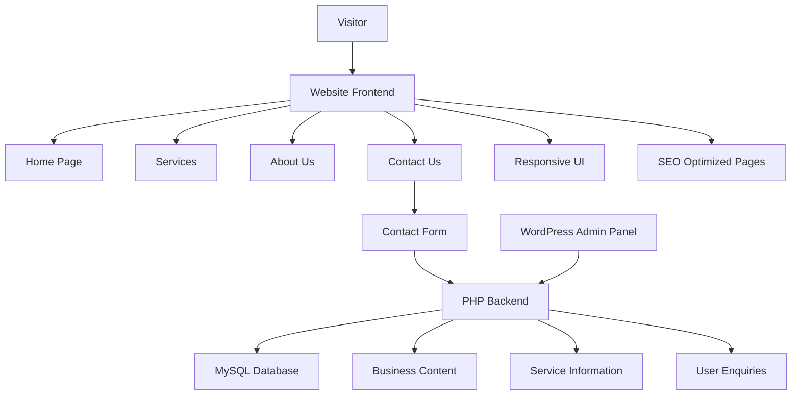

# Architecture Diagram

```mermaid
flowchart TD

A[Visitor] --> B[Website Frontend]

B --> C[Home Page]
B --> D[Services]
B --> E[About Us]
B --> F[Contact Us]

F --> G[Contact Form]

G --> H[PHP Backend]

H --> I[MySQL Database]

J[WordPress Admin Panel] --> H

H --> K[Business Content]
H --> L[Service Information]
H --> M[User Enquiries]

B --> N[Responsive UI]
B --> O[SEO Optimized Pages]

```
